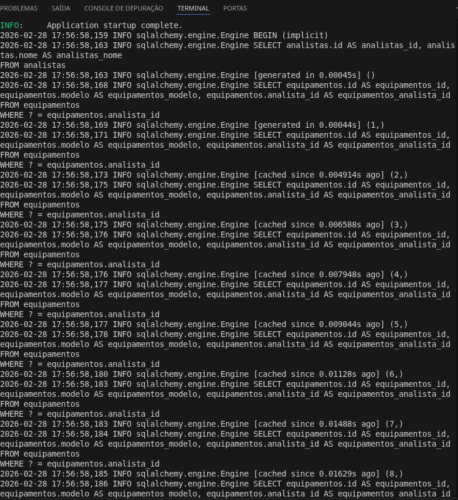

# 📊 Exercício 02: Otimização de Queries (O Problema N+1)

Este repositório faz parte da série de desafios de Backend, focando em um dos problemas de performance mais comuns em aplicações que utilizam ORMs (Object-Relational Mappers): as **N+1 Queries**.

## 🔴 O Problema: Consultas Excessivas ao Banco
O problema N+1 ocorre quando o sistema faz uma consulta inicial para recuperar uma lista de registros (1) e, em seguida, executa uma consulta adicional para cada registro da lista (N) para carregar dados relacionados.

### Cenário de Negócio (Gestão de Ativos de TI):
Imagine listar todos os **Analistas de TI** e seus respectivos **Equipamentos**.
1. Uma query busca os analistas: `SELECT * FROM analistas;`
2. Para cada analista retornado, o ORM executa: `SELECT * FROM equipamentos WHERE analista_id = ?;`

Se houver 100 analistas, teremos **101 consultas** ao banco de dados, gerando latência desnecessária e sobrecarga no servidor.



## 🟢 A Solução: Eager Loading com `joinedload`
A solução consiste em utilizar o **Eager Loading** (Carregamento Ansioso). Em vez de esperar o loop solicitar os dados, instruímos o SQLAlchemy a realizar um `LEFT OUTER JOIN` e trazer todos os dados relacionados em uma **única viagem** ao banco de dados.

### Implementação Otimizada:
```python
from sqlalchemy.orm import joinedload

# Otimizado: 1 única consulta com JOIN
analistas = db.query(Analista).options(joinedload(Analista.equipamentos)).all()

```

## 🛠️ Tecnologias Utilizadas

* **Python 3.13**
* **FastAPI**
* **SQLAlchemy** (ORM)
* **SQLite** (Banco de dados local)

## 🧪 Como observar a diferença na prática?

O projeto está configurado com `echo=True` no engine do SQLAlchemy para exibir os logs do SQL no terminal.

1. **Rota Ineficiente (`/inventario/lento`):**
Observe no terminal a "cascata" de múltiplos `SELECT` sendo executados um após o outro.
2. **Rota Eficiente (`/inventario/otimizado`):**
Observe no terminal que apenas **um único log de SELECT** é gerado, contendo a instrução `JOIN`.

---

## 🚀 Como Rodar o Projeto

1. Clone o repositório.
2. Crie e ative seu ambiente virtual:
```bash
python -m venv .venv && source .venv/bin/activate

```


3. Instale as dependências:
```bash
pip install fastapi uvicorn sqlalchemy

```


4. Popule o banco de dados inicial:
```bash
python seed.py

```


5. Inicie o servidor:
```bash
uvicorn main:app --reload

```


---

## 📈 Resultados

```

A aplicação desta técnica reduz drasticamente o tempo de resposta (TTFB) e o consumo de recursos de I/O, sendo essencial para sistemas que precisam escalar.

